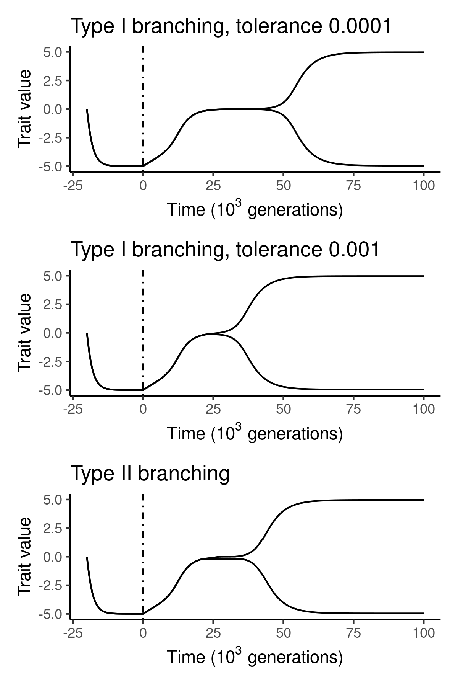

# speciome-approx-data

This repository contains simulation data generated by the program [`speciomx`](https://github.com/rscherrer/speciomx).

The data were generated in R using the script `generate_data.R` and `speciomx v1.1`.

Here is a comparison of different algorithms used to detect the branching point:

